# Diagrama de Caso de Uso - GeoMaker

```mermaid
graph TB
    User((Estudante))
    
    subgraph GeoMaker["Sistema GeoMaker"]
        UC1[Acessar Landing Page]
        UC2[Navegar para Dashboard]
        UC3[Visualizar Atividades Disponíveis]
        UC6[Voltar ao Dashboard]
        
        subgraph LabTriangulos["Laboratório de Triângulos"]
            UC4[Jogar Laboratório de Triângulos]
            UC4_1[Selecionar Tipo de Triângulo]
            UC4_2[Arrastar Retas para Canvas]
            UC4_3[Rotacionar e Mover Retas]
            UC4_4[Conectar Pontas das Retas]
            UC4_5[Analisar Triângulo Formado]
            UC4_6[Limpar Tela]
        end
        
        subgraph InvasaoEspacial["Invasão Espacial"]
            UC5[Jogar Invasão Espacial]
            UC5_1[Ler Convocamento da Missão]
            UC5_2[Identificar Naves por Cor e Posição]
            UC5_3[Atirar nas Naves Alienígenas]
            UC5_4[Seguir Dicas do Copiloto Enzo]
            UC5_5[Ver Resultado: Vitória/Derrota]
            UC5_6[Reiniciar Jogo]
        end
    end
    
    %% Relacionamentos do Usuário
    User -->|interage| UC1
    User -->|interage| UC2
    User -->|interage| UC3
    User -->|interage| UC4
    User -->|interage| UC5
    
    %% Navegação
    UC1 -.->|extend| UC2
    UC2 -->|include| UC3
    
    %% Laboratório de Triângulos
    UC4 -.->|include| UC4_1
    UC4 -.->|include| UC4_2
    UC4 -.->|include| UC4_3
    UC4 -.->|include| UC4_4
    UC4 -.->|include| UC4_5
    UC4 -.->|include| UC4_6
    UC4 -.->|extend| UC6
    
    %% Invasão Espacial
    UC5 -.->|include| UC5_1
    UC5 -.->|include| UC5_2
    UC5 -.->|include| UC5_3
    UC5 -.->|include| UC5_4
    UC5 -.->|include| UC5_5
    UC5 -.->|include| UC5_6
    UC5 -.->|extend| UC6
    
    classDef actor fill:#FFD700,stroke:#333,stroke-width:2px
    classDef usecase fill:#87CEEB,stroke:#333,stroke-width:1px
    classDef include fill:#90EE90,stroke:#333,stroke-width:1px
    
    class User actor
    class UC1,UC2,UC3,UC4,UC5,UC6 usecase
    class UC4_1,UC4_2,UC4_3,UC4_4,UC4_5,UC4_6 include
    class UC5_1,UC5_2,UC5_3,UC5_4,UC5_5,UC5_6 include
```

## Descrição dos Casos de Uso

### 1. Acessar Landing Page
**Descrição**: Usuário acessa a página inicial do GeoMaker  
**Ator**: Estudante  
**Fluxo**: Visualiza apresentação da aplicação com botão de entrada

### 2. Navegar para Dashboard
**Descrição**: Usuário navega para o painel de atividades  
**Ator**: Estudante  
**Fluxo**: Clica em "Entrar no Laboratório" e acessa lista de atividades

### 3. Visualizar Atividades Disponíveis
**Descrição**: Usuário visualiza as atividades educacionais  
**Ator**: Estudante  
**Fluxo**: Vê cards com informações de cada atividade (algumas bloqueadas)

### 4. Jogar Laboratório de Triângulos
**Descrição**: Atividade interativa de construção de triângulos  
**Ator**: Estudante  
**Casos de Uso Incluídos**:
- **UC4.1 - Selecionar Tipo de Triângulo**: Escolhe entre equilátero, isósceles, escaleno, retângulo ou livre
- **UC4.2 - Arrastar Retas para Canvas**: Arrasta segmentos da caixa para área de trabalho
- **UC4.3 - Rotacionar e Mover Retas**: Manipula retas clicando nas pontas (rotação) ou no corpo (movimento)
- **UC4.4 - Conectar Pontas das Retas**: Conecta extremidades das retas (ficam verdes quando conectadas)
- **UC4.5 - Analisar Triângulo Formado**: Sistema verifica regra de existência e classifica o triângulo
- **UC4.6 - Limpar Tela**: Remove todas as retas do canvas

**Regras de Negócio**:
- Retas têm tamanhos fixos em centímetros (escala 1cm = 20px)
- Triângulo é válido se: (a+b > c) E (a+c > b) E (b+c > a)
- Sistema fornece feedback visual (verde = conectado, análise em tempo real)

### 5. Jogar Invasão Espacial
**Descrição**: Jogo educacional sobre posicionamento espacial  
**Ator**: Estudante  
**Casos de Uso Incluídos**:
- **UC5.1 - Ler Convocamento da Missão**: Visualiza briefing com regras do jogo
- **UC5.2 - Identificar Naves por Cor e Posição**: Diferencia naves reais de hologramas
- **UC5.3 - Atirar nas Naves Alienígenas**: Clica nas naves para atirar (5 balas)
- **UC5.4 - Seguir Dicas do Copiloto Enzo**: Recebe instruções de cor e posição
- **UC5.5 - Ver Resultado**: Visualiza modal de vitória ou derrota
- **UC5.6 - Reiniciar Jogo**: Reinicia com novas posições de naves

**Regras de Negócio**:
- 5 naves reais + 7 hologramas falsos
- 5 balas disponíveis
- Vitória: acertar todas as 5 naves reais sem errar
- Derrota: acabar balas ou acertar holograma
- Dicas seguem ordem espacial (esquerda → direita)

### 6. Voltar ao Dashboard
**Descrição**: Retorna à lista de atividades  
**Ator**: Estudante  
**Fluxo**: Clica no botão de voltar em qualquer atividade

## Relacionamentos

- **<<extend>>**: UC1 → UC2 (landing page pode estender para dashboard)
- **<<include>>**: UC2 → UC3 (dashboard sempre inclui visualização de atividades)
- **<<include>>**: UC4 → UC4.1-6 (laboratório inclui todas as sub-funcionalidades)
- **<<include>>**: UC5 → UC5.1-6 (jogo inclui todas as etapas)
- **<<extend>>**: UC4,UC5 → UC6 (atividades podem estender para voltar)
