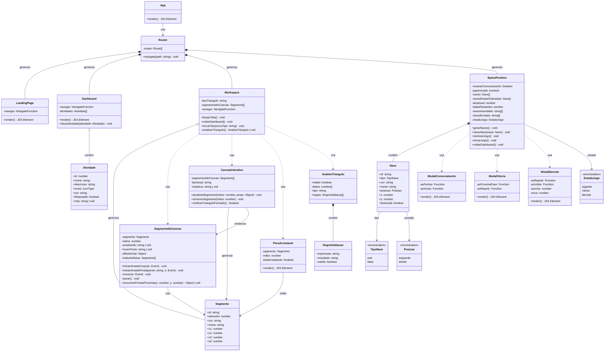

# Diagrama de Classes - GeoMaker

## Descrição das Classes Principais

### 1. App
**Responsabilidade**: Componente raiz da aplicação React  
**Métodos**:
- `render()`: Renderiza o RouterProvider com configuração de rotas

### 2. Router
**Responsabilidade**: Gerenciamento de navegação entre páginas  
**Implementação**: React Router (createBrowserRouter)  
**Rotas**:
- `/` → LandingPage
- `/dashboard` → Dashboard
- `/workspace` → Workspace
- `/space-position` → SpacePosition

### 3. LandingPage
**Responsabilidade**: Página inicial de apresentação  
**Características**:
- Logo e nome "GeoMaker"
- Título e descrição da aplicação
- Botão "Entrar no Laboratório"
- Efeitos visuais de fundo (círculos blur)

### 4. Dashboard
**Responsabilidade**: Painel de seleção de atividades  
**Atributos**:
- `atividades`: Array de 4 atividades (2 desbloqueadas, 2 bloqueadas)
**Métodos**:
- `clicarAtividade()`: Navega para atividade se desbloqueada

**Atividades Configuradas**:
1. O Mistério dos Triângulos (desbloqueado)
2. Invasão Espacial (desbloqueado)
3. Círculos Redondos (bloqueado)
4. Polígonos Especiais (bloqueado)

### 5. Atividade
**Responsabilidade**: Modelo de dados para atividades  
**Atributos**:
- `id`: Identificador único
- `nome`: Título da atividade
- `descricao`: Texto descritivo
- `icone`: Componente Lucide React
- `cor`: Código hexadecimal da cor
- `bloqueado`: Estado de disponibilidade
- `rota`: Path para navegação (null se bloqueado)

### 6. Workspace (Laboratório de Triângulos)
**Responsabilidade**: Atividade de construção de triângulos  
**Características**:
- Drag-and-drop de segmentos de reta
- 5 tipos de desafio (equilátero, isósceles, escaleno, retângulo, livre)
- Sistema de snap/conexão de pontas (verde quando conectado)
- Análise em tempo real da validade do triângulo

**Métodos Principais**:
- `limparTela()`: Remove todos os segmentos do canvas
- `trocarTipo()`: Altera tipo de desafio e limpa canvas
- `analisarTriangulo()`: Valida triângulo e retorna análise completa

**Constante ESCALA**: 1cm = 20 pixels

### 7. Segmento
**Responsabilidade**: Modelo de reta no canvas  
**Atributos**:
- `id`: Identificador único (timestamp + random)
- `tamanho`: Comprimento em centímetros
- `cor`: Cor da reta (hexadecimal)
- `nome`: Label exibida (ex: "Reta 1")
- `x1, y1`: Coordenadas da primeira ponta
- `x2, y2`: Coordenadas da segunda ponta

### 8. SegmentoNoCanvas
**Responsabilidade**: Componente interativo de reta no SVG  
**Funcionalidades**:
- Arrastar corpo da reta (move inteira)
- Arrastar pontas (rotaciona mantendo tamanho)
- Snap automático quando próximo de outra ponta (< 50px)
- Indicador visual de conexão (ponta verde)
- Botão de remoção

**Métodos**:
- `encontrarPontasProximas()`: Detecta pontas próximas para snap
- `iniciarArrasteCorpo()`: Inicia movimento da reta
- `iniciarArrastePonta()`: Inicia rotação da reta
- `mover()`: Atualiza posição durante arraste
- `parar()`: Finaliza interação

### 9. CanvasInterativo
**Responsabilidade**: Área de trabalho para construção  
**Funcionalidades**:
- Drop zone para receber retas arrastadas
- Renderiza todos os segmentos
- Verifica fechamento de triângulo (3 conexões)
- Mostra mensagem de sucesso quando triângulo fecha

**Método Principal**:
- `verificarTrianguloFechado()`: Verifica se 3 retas estão conectadas formando triângulo

### 10. PecaArrastavel
**Responsabilidade**: Card de reta na caixa lateral  
**Características**:
- Usa react-dnd para drag
- Mostra tamanho em cm
- Barra visual proporcional ao tamanho
- Indicador "∞ ilimitado" (pode usar múltiplas vezes)

### 11. SpacePosition (Invasão Espacial)
**Responsabilidade**: Jogo educacional de posicionamento  
**Mecânica**:
- 12 naves: 5 reais + 7 hologramas
- 5 balas disponíveis
- Dicas sequenciais do copiloto Enzo
- Naves distribuídas em esquerda/direita
- Cores podem se repetir em ambos os lados

**Métodos Principais**:
- `gerarNaves()`: Cria distribuição aleatória de naves
- `clicarNave()`: Processa tiro e verifica acerto/erro
- `reiniciarJogo()`: Reseta estado e gera novas posições

**Estados do Jogo**:
- `jogando`: Em andamento
- `vitoria`: Acertou todas as 5 naves sem errar
- `derrota`: Acabaram balas ou acertou holograma

### 12. Nave
**Responsabilidade**: Modelo de nave no jogo  
**Atributos**:
- `tipo`: 'real' ou 'falsa'
- `posicao`: 'esquerda' ou 'direita'
- `cor`: Código hexadecimal
- `nome`: Nome da cor (ex: "vermelha", "azul")
- `x, y`: Posição no canvas (percentual)
- `destruida`: Estado após ser atingida

### 13. AnaliseTriangulo
**Responsabilidade**: Resultado da validação geométrica  
**Atributos**:
- `valido`: Se passa na regra de existência
- `lados`: Array com 3 tamanhos em cm
- `tipo`: Classificação (Equilátero, Isósceles, Escaleno)
- `regras`: Array de 3 validações

**Regra de Existência**:
- (a + b) > c
- (a + c) > b
- (b + c) > a

**Classificação**:
- Equilátero: 3 lados iguais
- Isósceles: 2 lados iguais
- Escaleno: 3 lados diferentes

### 14. RegraValidacao
**Responsabilidade**: Modelo de validação individual  
**Atributos**:
- `expressao`: Fórmula (ex: "10 + 11 > 12")
- `resultado`: Cálculo (ex: "21 > 12")
- `valida`: Boolean do resultado

### 15-17. Modais (ModalConvocamento, ModalVitoria, ModalDerrota)
**Responsabilidade**: Interfaces de feedback do jogo  
**ModalConvocamento**:
- Briefing da missão
- Personagem Enzo
- Explicação das regras

**ModalVitoria**:
- Animações de celebração
- Estatísticas (5/5 acertos, 100% precisão)
- Botões: "Repetir Missão" e "Próxima Fase"

**ModalDerrota**:
- Mensagem de encorajamento
- Estatísticas de desempenho
- Dica educativa
- Botões: "Voltar" e "Tentar Novamente"

## Padrões de Design Utilizados

### 1. Component Pattern (React)
Toda a aplicação usa componentes funcionais React com hooks

### 2. State Management
- `useState`: Gerenciamento de estado local
- `useNavigate`: Hook de navegação

### 3. Drag and Drop
- `react-dnd` com HTML5Backend
- `useDrag` para itens arrastáveis
- `useDrop` para áreas de drop

### 4. Composition over Inheritance
Componentes são compostos, não há herança de classes

### 5. Single Responsibility
Cada classe/componente tem responsabilidade única e bem definida

## Tecnologias e Bibliotecas

- **React**: 18.3.1
- **TypeScript**: Tipagem estática
- **React Router**: 7.13.0 (navegação)
- **React DnD**: 16.0.1 (drag-and-drop)
- **Tailwind CSS**: 4.1.12 (estilização)
- **Lucide React**: 0.487.0 (ícones)
- **Motion**: 12.23.24 (animações)
